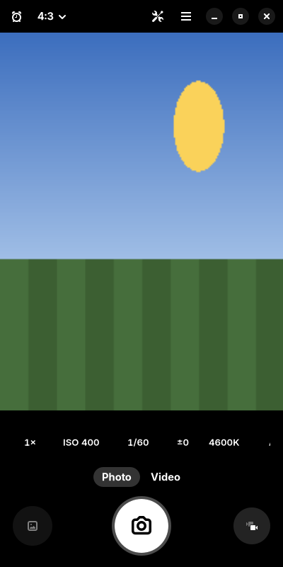

> **Unofficial.** Not affiliated with or endorsed by postmarketOS, Google, or
> Qualcomm. Do not report problems with this port to postmarketOS; open an
> issue here.
>
> **Experimental.** Flashing can brick the device or erase data. No warranty,
> see COPYING.
>
> **AI-assisted.** See [AI.md](AI.md).

# Obscura

A camera app for phones and computers that talks to libcamera directly, so it
can offer whatever the camera itself can do. GTK 4 and libadwaita, written in
Rust.



- Controls generated from what the camera reports: exposure time, sensitivity,
  exposure compensation, white balance, focus, frame rate and more
- Every sensor mode the camera offers, from full resolution to high frame rate
  binned modes
- RAW photos as DNG alongside JPEG, and video recording
- Live readout of exposure, sensitivity, colour temperature and focus

## Build

Needs gtk4 >= 4.20, libadwaita >= 1.8, libcamera >= 0.7, GStreamer >= 1.24,
a Rust toolchain (edition 2024, rust >= 1.93), meson >= 1.4, and libclang for
libcamera-sys' bindgen.

```sh
meson setup build
meson compile -C build
meson install -C build
```

The `cargo_features` meson option passes cargo features through, for example
`-Dcargo_features=pipewire-controls` for sandboxed builds (needs PipeWire's
development headers).

## Develop

```sh
cargo fmt --check
cargo clippy --release --locked -- -D warnings
cargo test --release --locked --features pipewire-controls
build-aux/preview/check.sh          # UI checks against a fake camera, headless
```

These are the steps `.github/workflows/ci.yml` runs. `build-aux/preview/`
explains the fake camera and the headless session.

- Flatpak builds and the camera portal path: [`docs/flatpak.md`](docs/flatpak.md)
- Cross-building for an aarch64 Alpine or postmarketOS device:
  `build-aux/cross-build.sh` (see its header for the sysroot it expects)

## Licence

GPL-3.0-or-later, see [`COPYING`](COPYING). Provided as is, without warranty of
any kind.
